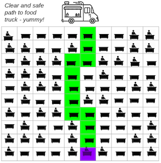
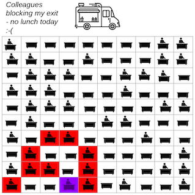

# Open Space-ial Distancing

ThoughtWorks Australia Shokunin 2020 April Challenge.

## Usage

-   Install Node.js 12.16.2 or install [NVM](https://github.com/nvm-sh/nvm) and run `nvm install`
-   Run `./go`
-   Run tests: `npm t`

## Problem Statement

### Background

You've just fixed the build and you are hungry. It's well past lunchtime.

Unfortunately, you are trapped at the back of your client's office in the furthest row of desks from the exit. There is a food truck just outside the office, but it is leaving soon and is your only option for lunch today!

You'll need to make it to the other end of the office to leave the building, attack the food truck and satisfy your growling stomach.

_Sounds easy? Not so._

Some of the office is occupied with people who have wisely visited the food truck already and are now settling into their afternoon's work (i.e., sleeping peacefully at their desk).

In a staggering display of 1960s utilitarian office design, there are identical beige formica desks every 2 metres across the width of the office and every 2 metres from the back of the office (where you sit) to the front... and access to deep fried heaven! These desks form a perfectly bland grid of 10 rows of 10 desks each.

### Challenge

Current company policy insists you must _always_ keep at least 1.5m away from all colleagues (punishment for failing to do so is an extra 20 hours of online compliance training), so you'll need to find a way out of the office **_without going near any occupied desk_**.

 

Not every desk is occupied. The percentage of occupied desks is _p_. (0.0 ≤ p ≤ 1.0)

Your task is to calculate the chance of finding an OHS-approved way to leave the office for various values of _p_.

Start with a value of 0 for _p_ (i.e., a completely empty office apart from yourself) and add 0.1 to it until you reach 1.0 (i.e., a fully occupied office _including yourself_). For each value of _p_, randomly populate the office and try to plot a safe way through. Repeat this process a significant number of times to be confident of your results.

Your calculation is the percentage of random offices which have (at least one) safe exit path for each value of p. Sample output would look something like:

```
Number of samples for each p: 10000
1.0 0.000
0.9 0.000
0.8 0.000
0.7 0.000
0.6 0.011
0.5 0.074
0.4 0.625
0.3 0.940
0.2 1.000
0.1 1.000
0.0 1.000
```

_Note: You are a mere IT consultant, so jumping 2 metres over or diagonally across an occupied desk is not a skill you have IRL._

### Submission

_What to submit?_

-   A link to your **Github solution repo** in a response to this email

_When to submit?_

-   By 23:59:59 on Wednesday April 15th AEST (that's 2 weeks away)

_What language(s) can I use?_

-   Anything you feel happy/comfortable with, as long as it allows you to demonstrate the following Criteria for Awesomeness.

### Criteria for Awesomeness

1. Solving the problem as outlined in "Challenge"
2. Clean Code. _Note: I'll be paying special attention to the approach you've used to determine whether a path out of the office exists._

-   _If your solution is particularly performant, let me know._
-   _If your solution is easily testable, let me know._
-   _If your solution is eminently customisable, let me know._
-   _If your solution is X... let me know._

3. Evidence of TDD
4. A go script and appropriate README
